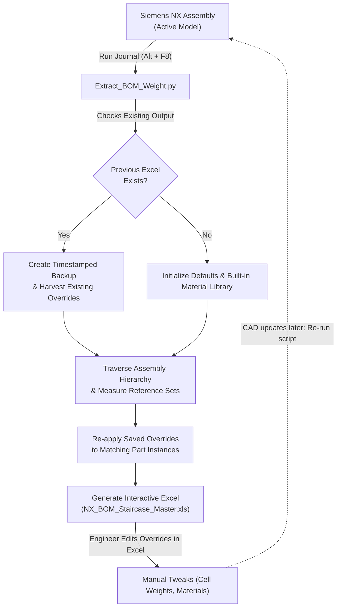

# Siemens NX & Teamcenter BOM & Weight Extractor

[](https://www.python.org/)
[](https://plm.sw.siemens.com/en-US/nx/)
[](https://plm.sw.siemens.com/en-US/teamcenter/)
[-brightgreen.svg)]()
[](LICENSE)

An automated **Siemens NX Journal** (Native Python) that extracts multi-level Bill of Materials (BOM), computes solid geometry mass & volume, resolves CAD modeling edge-cases, and features **two-way persistent synchronization** with Microsoft Excel.

Built for mechanical engineers, battery pack designers, CAD administrators, and engineering managers who need rapid, audit-proof BOM updates without losing manual overrides across design revisions.

---

## 💡 Why This Tool Exists

In complex mechanical systems—such as **Electric Vehicle (EV) Battery Packs, Powertrains, and Industrial Machinery**—assemblies contain dozens to hundreds of components undergoing frequent design updates.

Engineers routinely face major hurdles:
1. **CAD Volume vs. Real-World Mass Discrepancies**:
   - A lithium-ion battery cell is typically CAD-modeled as a hollow aluminum or steel can to keep CAD files lightweight. The internal jelly roll (anode, cathode, separator) and liquid electrolyte are rarely modeled in 3D.
   - Measuring mass strictly from CAD geometry results in completely inaccurate weight calculations.
2. **Loss of Manual Overrides on Re-export**:
   - Every time an updated BOM is exported, manual annotations, corrected weights, and overridden materials are wiped out, forcing engineers to manually re-enter data repeatedly.
3. **Strict Corporate IT Restrictions**:
   - Most enterprise engineering workstations block `pip install`. Third-party Python libraries like `pandas`, `openpyxl`, or `xlsxwriter` cannot be installed in the embedded NX Python environment.
4. **Reference Set Inconsistencies**:
   - Assemblies and parts frequently use varied reference set conventions (`Ahead Model`, `MODEL`, unblanked solid bodies, etc.). Standard export tools often extract zero volume or miss bodies entirely.

**This script solves all of these problems in a single, zero-dependency NX Journal.**

---

## ✨ Key Features

- **🚀 Zero External Dependencies**:
  Runs directly in the native Siemens NX Python Journal environment (`NXOpen`). No `pip`, no external packages, no IT permissions required.
- **🪜 Visual "Staircase" Multi-Level BOM**:
  Visual assembly hierarchy with dedicated level columns (Levels 1–5+) highlighted in yellow for instant comprehension of parent-child relationships.
- **🔄 Non-Destructive Two-Way Excel Sync**:
  Re-running the script updates quantities, adds new parts, and removes deleted items **while preserving all your manual overrides** (custom materials, custom densities, and direct part weight overrides).
- **🛡️ Automatic Timestamped Backups**:
  Never lose historical data. Every run archives the existing spreadsheet with a timestamp (e.g., `NX_BOM_Staircase_Master_YYYYMMDD_HHMMSS.xls`) before writing the updated version.
- **🔋 EV Battery & Hardware-Ready Overrides**:
  - Assign direct weights to components (e.g., enter `0.048 kg` for an 18650 cell or `0.070 kg` for a 21700 cell) bypassing CAD volume.
  - Choose replacement materials from an interactive Excel dropdown.
- **📊 Embedded Materials Library & Live Formulas**:
  - Automatically exports a second Excel sheet (`Materials Library`) listing standard and harvested materials.
  - BOM uses dynamic formulas (`VLOOKUP`, `IF`, multiplication) so manual edits recalculate immediately inside Excel.
- **🏷️ Automated Component Classification**:
  Classifies items automatically into:
  - **`A`** - Assembly
  - **`C`** - Child Component / Part
  - **`H`** - Hardware & Fasteners (Bolts, Screws, Nuts, Washers, Rivets, Studs)
  - **`P`** - Electrical / EEE (Battery, Cell, Busbar, Wire, Cable, Connector, PCB, Harness)
- **🔗 Teamcenter & Native NX Compatibility**:
  Extracts `DB_PART_NO`, `DB_PART_REV`, and `DB_PART_NAME` when connected to Teamcenter. Automatically falls back to native part leaf names if working in standalone NX.

---

## 🔄 The Non-Destructive Sync Workflow



---

## 📋 Excel Output Structure (22 Columns)

The generated Excel workbook (`NX_BOM_Staircase_Master.xls`) uses Microsoft XML Spreadsheet format, fully compatible with Microsoft Excel, LibreOffice, and Google Sheets:

| Col # | Column Header | Description | Source / Logic |
|:---:|:---|:---|:---|
| **1–6** | **Assembly Level** | Visual staircase columns (1 to 5+) | Highlighted yellow on active level |
| **7** | **Item Name** | Component description or part title | `DB_PART_NAME` or NX DisplayName |
| **8** | **Assly / Child Part** | Classification code (`A`, `C`, `H`, `P`) | Automatic geometry/name classifier |
| **9** | **Category** | Discipline category (`Mech.`, `EEE`) | Automatic rule-based classifier |
| **10** | **Part Number** | Part number / Item ID | `DB_PART_NO` or Part Leaf |
| **11** | **Parent Part** | Part number of the parent assembly | Structural hierarchy tracker |
| **12** | **Qty** | Occurrence count in parent subassembly | Computed from assembly children |
| **13** | **Volume/Part (mm³)** | Measured solid volume | NX MassProperties API |
| **14** | **Total Volume (mm³)** | Combined volume for all instances | Excel formula: `=Qty * Volume/Part` |
| **15** | **NX Material** | Material assigned in NX CAD | Extracted via NX `LocateMaterial` / attributes |
| **16** | **NX Density (kg/mm³)** | Density assigned in NX CAD | CAD density or library default |
| **17** | **Override Material** | User-selected material override | **Excel Data Validation Dropdown** |
| **18** | **Override Density** | Custom user-entered density | Manual input cell (retained on re-runs) |
| **19** | **Active Density** | Final density used in calculations | Excel formula: `=IF(Override Density, ..., VLOOKUP(Override Material), NX Density)` |
| **20** | **Override Weight/Part** | Direct part weight override (e.g. Li-ion cell) | Manual input cell (retained on re-runs) |
| **21** | **Weight/Part (kg)** | Net calculated unit weight | Excel formula: `=IF(Override Weight, ..., Active Density * Volume)` |
| **22** | **Total Weight (kg)** | Net line-item total weight | Excel formula: `=Weight/Part * Qty` |

---

## 🚀 Quick Start Guide

### Prerequisites
- Siemens NX (NX 11, NX 12, NX 1847 Series, NX 1980 Series, NX 2007 Series, NX 2212, NX 2306, NX 2312, NX 2406+)
- Configured with Teamcenter or running in Native NX mode
- No additional Python packages or admin rights required!

### Running the Script

1. **Open your target assembly** in Siemens NX.
2. In the NX top menu, navigate to:
   - **Menu** $\rightarrow$ **Tools** $\rightarrow$ **Journal** $\rightarrow$ **Play...** *(or press `Alt + F8`)*.
3. Browse and select [`Extract_BOM_Weight.py`](Extract_BOM_Weight.py).
4. Click **Run**.
5. Monitor progress in the NX **Listing Window**:
   ```text
   Processing BOM and extracting Geometry...
   --------------------------------------------------
   SUCCESS! Excel BOM generated with all reference set variations.
   File updated: C:\Users\<Username>\Desktop\NX_BOM_Staircase_Master.xls
   --------------------------------------------------
   ```
6. Open `NX_BOM_Staircase_Master.xls` on your **Desktop**.

> [!NOTE]
> Make sure the Excel file is **closed** in Microsoft Excel before re-running the script so NX has write permissions to update the file.

---

## ⚙️ Configuration & Customization

The top section of [`Extract_BOM_Weight.py`](Extract_BOM_Weight.py) contains configurable settings:

```python
# Output Excel filename (saved to your Desktop by default)
XML_EXCEL_NAME = "NX_BOM_Staircase_Master.xls"

# Include part revision in the top banner title (e.g., ITEM12345/A - BOM STRUCTURE)
INCLUDE_REVISION_IN_TITLE = True

# Reference sets searched for solid geometry (case-insensitive)
TARGET_REFSETS = ["Ahead Model", "AHEAD_MODEL", "AHEAD MODEL", "MODEL"]

# Default material density dictionary in metric units (kg/mm³)
DEFAULT_MATERIALS = {
    "STEEL (MILD / CARBON)": 0.00000785,
    "STAINLESS STEEL 304":   0.00000800,
    "ALUMINUM 6061":         0.00000270,
    "BRASS / FREE CUTTING":  0.00000847,
    "COPPER":                0.00000896,
    "ABS PLASTIC":           0.00000105,
    "NYLON (PA6)":           0.00000114,
    "POLYCARBONATE (PC)":    0.00000120,
    "POM (DELRIN / ACETAL)": 0.00000142,
    "RUBBER / EPDM":         0.00000115
}
```

### Density Units Conversion Reference
| Material | $\text{g/cm}^3$ | $\text{kg/m}^3$ | $\text{kg/mm}^3$ (NX Standard) |
|:---|:---:|:---:|:---:|
| **Steel (Mild)** | 7.85 | 7,850 | `0.00000785` |
| **Stainless Steel 304** | 8.00 | 8,000 | `0.00000800` |
| **Aluminum 6061** | 2.70 | 2,700 | `0.00000270` |
| **Copper** | 8.96 | 8,960 | `0.00000896` |
| **ABS Plastic** | 1.05 | 1,050 | `0.00000105` |
| **Nylon (PA6)** | 1.14 | 1,140 | `0.00000114` |

---

## 📖 In-Depth User Guide

For detailed documentation, including:
- EV battery pack modeling case study
- Fastener and hardware management
- Setting up a 1-click custom ribbon button in NX
- Teamcenter attribute mapping deep-dive
- Detailed troubleshooting and FAQ

👉 Please see [**USER_GUIDE.md**](USER_GUIDE.md).

---

## 🤝 Contributing

Contributions, bug reports, and enhancements are welcome! Please check out [CONTRIBUTING.md](CONTRIBUTING.md) for guidelines on testing and submitting pull requests.

---

## 📄 License

This project is licensed under the [MIT License](LICENSE) - feel free to use and adapt it for personal, academic, or commercial engineering projects.

---

*Disclaimer: Siemens NX and Teamcenter are registered trademarks of Siemens Digital Industries Software. This open-source project is independently developed and not affiliated with or endorsed by Siemens.*

